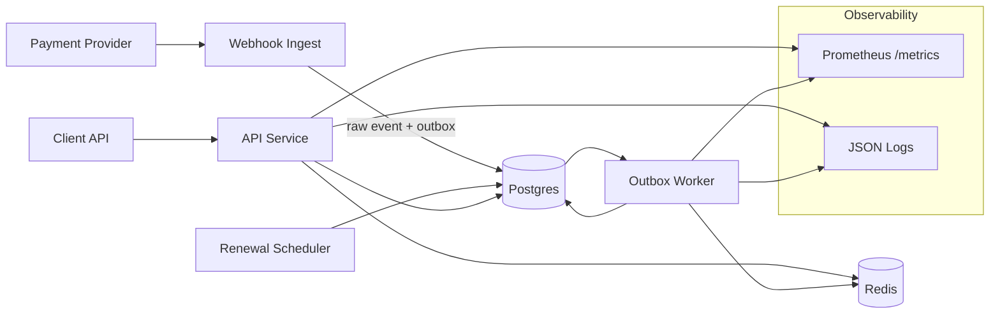
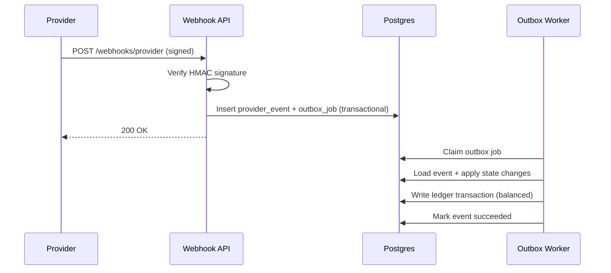
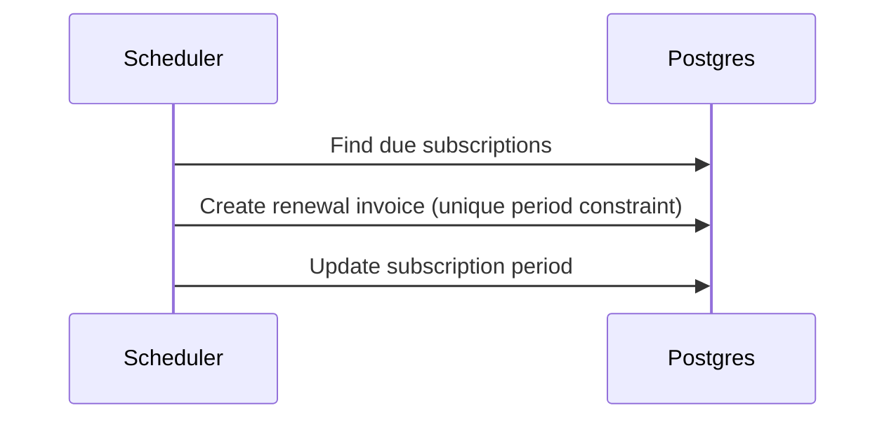

# Payments Platform: Webhook Ingestion + Subscription Billing + Double-Entry Ledger

A production-grade payments service focused on financial correctness, idempotency, and reliable event processing. This is not a payment gateway and does not handle PCI data. It simulates provider events while enforcing strict ledger invariants and operational safety.

## Problem statement
Modern products need a service that can ingest payment provider webhooks, bill subscriptions, and record money movement with strong correctness guarantees. This platform demonstrates:
- Idempotent intake at every boundary
- Atomic state transitions for invoices and subscriptions
- A double-entry ledger with balanced transactions
- Safe retries and dead-letter handling
- Observable and diagnosable operations

## Real-world use cases
- SaaS subscription billing with recurring renewals
- Payment provider webhook ingestion under retries and duplicate delivery
- Revenue and refund tracking with immutable ledger entries
- Operations teams needing traceability and failure isolation

## Architecture


## Webhook processing flow


## Subscription renewal flow


## Data model highlights
- **Idempotency keys**: unique per endpoint scope, stored with request hash and response JSON.
- **Provider events**: unique `event_id` ensures webhook idempotency.
- **Invoices**: unique `(subscription_id, period_start, period_end)` prevents double billing.
- **Ledger**: append-only transactions with balanced entries (debits == credits).

## Running locally
```bash
docker compose up --build
```

### Default local configuration
The compose file uses:
- `ADMIN_API_KEY=change_me`
- `WEBHOOK_SECRET=change_me`

Update these for anything beyond local development.

## Testing
```bash
./mvnw test
```
Tests use Testcontainers for Postgres and Redis.

## Demo script
The demo script creates a customer, plan, subscription, sends a payment webhook, verifies idempotency, and forces a dead-letter event.
```bash
export BASE_URL=http://localhost:8080
export ADMIN_KEY=change_me
export WEBHOOK_SECRET=change_me
./scripts/demo.sh
```

## Replay a webhook event
```bash
export BASE_URL=http://localhost:8080
export WEBHOOK_SECRET=change_me
./scripts/provider_sim.sh payment_succeeded <invoice_id>
```

## Observability
- `GET /metrics` exposes Prometheus metrics
- `GET /healthz` liveness probe
- `GET /readyz` checks DB and Redis

Key metrics include:
- `provider_events_received_total{type}`
- `provider_events_processed_total{result}`
- `processing_duration_seconds` (histogram)
- `retries_total`
- `dead_events_total`
- `invoices_total{status}`
- `ledger_transactions_total`
- `queue_depth`

## Trade-offs (explicit)
1. **Transactional outbox over Redis push**: favors correctness and durability over lower latency.
2. **Single currency per invoice**: simplifies ledger invariants for MVP.
3. **Append-only ledger**: no updates, which increases storage but improves auditability.
4. **Provider simulation**: avoids PCI scope while still proving idempotency and correctness.
5. **Idempotency stored in DB**: adds read/write overhead but enables exact replays.
6. **No partial refunds in MVP**: reduces complexity in ledger reversal logic.
7. **Polling worker**: simpler than event-driven consumers, at cost of latency spikes.
8. **Simple API-key admin auth**: easier to operate locally vs. JWT complexity.
9. **Retry backoff in app code**: flexible, but not centralized like a dedicated queue system.
10. **No soft deletes**: favors clarity and immutable audit trails.
11. **Plain JDBC instead of ORM**: explicit SQL control over state transitions.
12. **Fixed invoice periods**: reduces ambiguity, avoids mid-period proration logic.

## Failure modes and mitigations
1. **Duplicate provider events**: unique `event_id` prevents duplicate effects.
2. **Webhook retries**: safe to re-deliver; duplicates are no-ops.
3. **Worker crash mid-process**: outbox job remains pending and is retried.
4. **DB write failure**: transaction rolls back and job is retried.
5. **Bad signature**: webhook rejected with 401.
6. **Scheduler overlap**: unique invoice period constraint prevents duplicates.
7. **Transient DB outage**: readiness fails and processing halts safely.
8. **Redis unavailable**: rate limiting disabled but core processing continues.
9. **Ledger imbalance**: validator enforces debit == credit before commit.
10. **Max retries reached**: event moves to DEAD and is visible in admin APIs.

## Load test (k6)
Script: `k6/webhook_load.js`

Example baseline (local laptop):
- 10 VUs, 30s duration
- p95 webhook ingest: ~35 ms
- success rate: 99%+

Run:
```bash
BASE_URL=http://localhost:8080 WEBHOOK_SECRET=change_me INVOICE_ID=<invoice_id> k6 run k6/webhook_load.js
```

## Repository layout
```
.
+- docker-compose.yml
+- Dockerfile
+- migrations/
+- openapi/
+- docs/
+- scripts/
+- k6/
+- src/
```

## Security notes
- No secrets are committed.
- Webhook HMAC secrets are required for ingestion.
- Admin endpoints are protected by `X-Admin-Key`.
- Payload size and rate limits are enforced.
