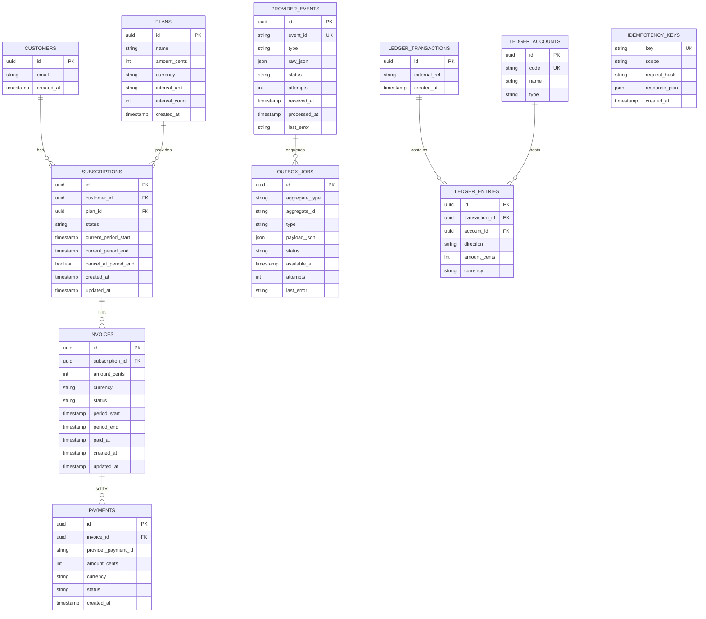
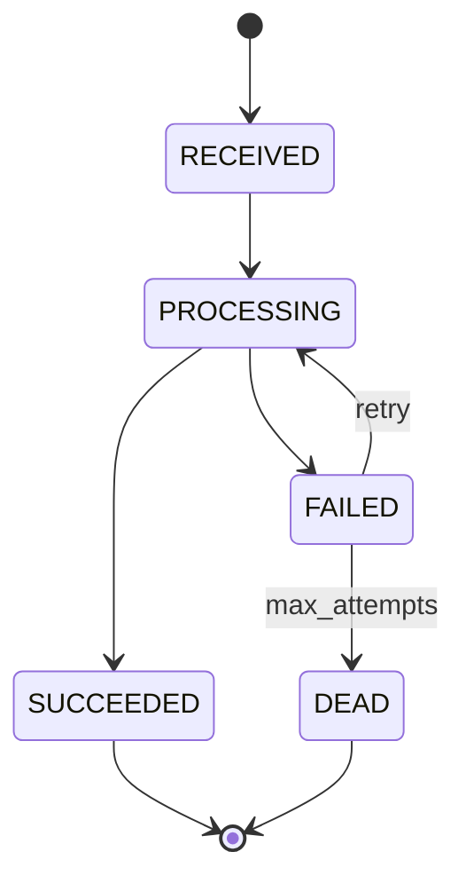
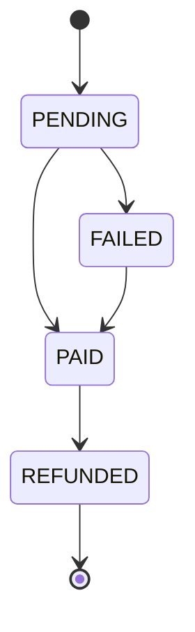
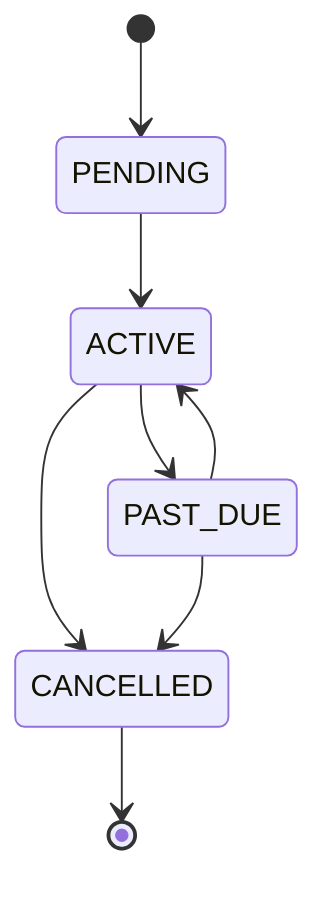

# Architecture

## Components
- **API Service**: REST endpoints for customers, plans, subscriptions, invoices, and admin stats.
- **Webhook Ingest**: Validates signatures, stores raw provider events, and enqueues outbox jobs.
- **Outbox Processor (Worker)**: Pulls jobs, processes provider events, applies state changes, writes ledger entries, and retries on failure.
- **Scheduler**: Periodically generates renewal invoices with period uniqueness enforcement.
- **PostgreSQL**: Source of truth for all state, idempotency, ledger, and outbox jobs.
- **Redis**: Optional rate limiting and lightweight locks.
- **Observability**: JSON logs + Prometheus metrics + health/readiness endpoints.

## Data Model (ER)

## State Machines

### Provider Events

### Invoices

### Subscriptions

## Idempotency Strategy
- **Client requests**: `Idempotency-Key` header required for create endpoints. Stored in `idempotency_keys` with `scope` and a request hash. Duplicate key returns the stored response. Same key with different payload returns 409.
- **Webhook events**: `provider_events.event_id` is unique. Duplicate events return 200 without side effects.
- **Invoice periods**: `UNIQUE (subscription_id, period_start, period_end)` prevents double billing.

## Outbox Choice and Justification
- **Transactional Outbox** in Postgres ensures the event record and outbox job are committed atomically.
- Webhook ingest never loses events even if the worker is down.
- Worker retries safely with `SELECT ... FOR UPDATE SKIP LOCKED` and backoff.

## Retry and DLQ Strategy
- Exponential backoff with jitter: `delay = base * 2^attempt + random(0, jitter)`.
- Attempts tracked on both `provider_events` and `outbox_jobs`.
- After `max_attempts`, mark event and outbox job as `dead` and expose in admin endpoints.

## Ledger Guarantees
- Ledger transactions are append-only.
- Every transaction has at least two entries.
- `sum(debit) == sum(credit)` is enforced in code and tested.
- All amounts stored in minor units (cents) with explicit currency.
